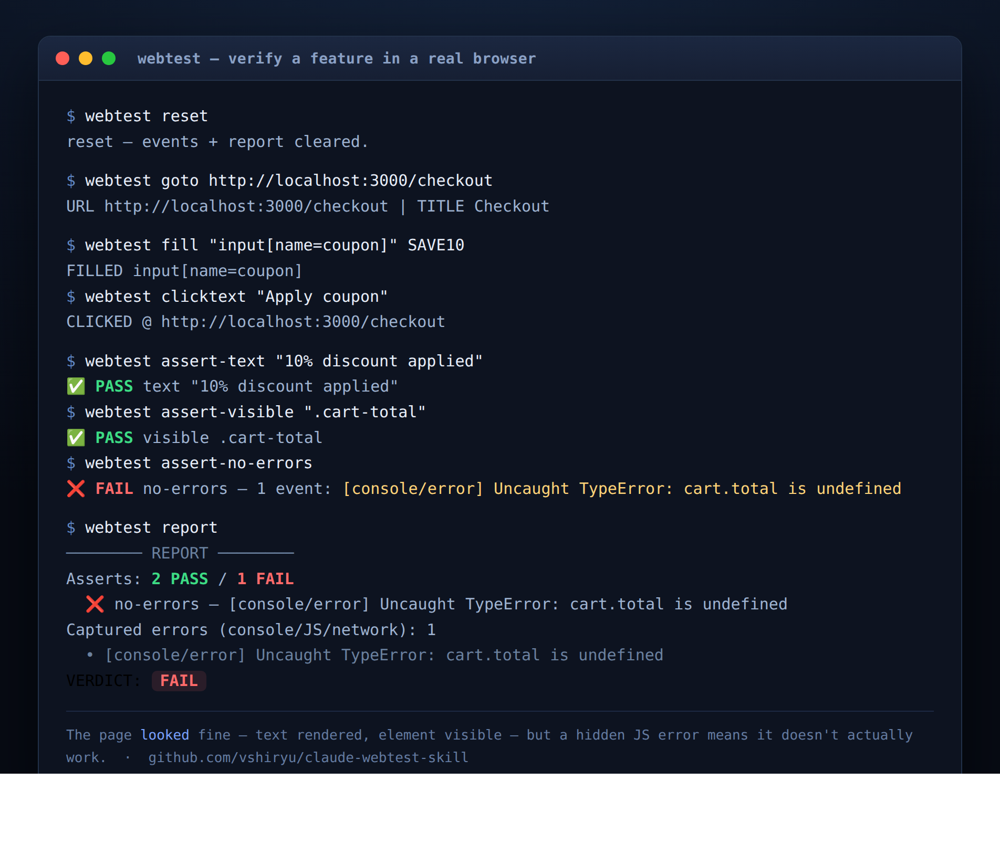

# webtest

[English](README.md) · **Português**

**Teste de funcionalidades** em navegador para as suas próprias aplicações web (Next.js,
Laravel, etc.), como skill do [Claude Code](https://claude.ai/code). Dirige um Chrome real
pelo DevTools Protocol para exercitar uma feature de ponta a ponta, **captura
automaticamente erros de console/JS e requisições que falharam**, roda asserções e gera um
**relatório PASS/FAIL** com screenshots como evidência.

Pega os bugs que uma conferida visual rápida não vê: uma página que *renderiza* bem mas
lança erro no console, falha uma requisição, ou cujo JS do cliente nem carrega.

<p align="center">
  
</p>

## Por que é diferente de "só abrir um navegador"

Um **monitor** persistente fica plugado no Chrome a sessão inteira e registra todo erro/aviso
de console, exceção não tratada, requisição que falhou e HTTP >= 400. As asserções somadas a
esse feed de eventos te dão um veredito de verdade, não só um screenshot que *parece* ok.

## Requisitos

- Google Chrome / Chromium no `PATH`
- Node.js 18+
- A máquina precisa alcançar a sua aplicação (localhost ou qualquer URL)

## Instalação

```bash
git clone https://github.com/vshiryu/claude-webtest-skill ~/.claude/skills/webtest
cd ~/.claude/skills/webtest && npm install
```

O Claude Code descobre automaticamente como a skill `webtest`. Invoque com `/webtest`, ou
simplesmente peça ao Claude para "testar a feature X em http://localhost:3000".

## Uso

```bash
WT=~/.claude/skills/webtest/webtest.sh

bash "$WT" wait-up http://localhost:3000      # espera a app responder
bash "$WT" reset                              # limpa o feed de erros + relatório
bash "$WT" login --url=http://localhost:3000/login --user=eu@x.com --pass=secreta
bash "$WT" goto http://localhost:3000/clientes/novo
bash "$WT" fill "input[name=nome]" "Cliente Teste"
bash "$WT" clicktext "Salvar"
bash "$WT" assert-url "/clientes"             # redirecionou para a lista
bash "$WT" assert-text "Cliente Teste"        # a nova linha aparece
bash "$WT" assert-no-errors                   # sem erros de console/JS/rede
bash "$WT" report                             # -> VERDICT: PASS / FAIL
```

## Comandos

| Grupo | Comando |
|---|---|
| ciclo de vida | `start` · `stop` · `restart` · `status` |
| subir app | `wait-up <url> [--timeout=ms]` |
| navegar | `goto <url>` · `back` · `wait <sel>` · `scroll <bottom\|top\|px>` |
| agir | `click <sel>` · `clicktext <texto>` · `type <sel> <texto>` · `fill <sel> <texto>` · `press <tecla>` |
| login | `login --url= --user= --pass= [--userSel= --passSel= --submitSel=]` |
| inspecionar | `eval <js>` · `text [sel]` · `links [filtro]` · `info` · `shot [nome] [--full]` |
| teste | `reset` · `assert-text` · `assert-no-text` · `assert-url` · `assert-visible` · `assert-gone` · `assert-no-errors [--include4xx] [--strict]` · `events [--errors]` · `report` |

- As asserções imprimem `✅ PASS` / `❌ FAIL`, anexam ao relatório, saem com código diferente
  de zero em caso de falha, e tiram screenshot automático em `fail-<assert>.png` quando falham.
- `assert-no-errors` falha em exceções de JS, erros de console, requisições que falharam e
  HTTP 5xx por padrão; `--include4xx` também conta 4xx, `--strict` também conta avisos de console.

## Como funciona

- `webtest.sh`: ciclo de vida (Chrome + monitor) + wrapper de CLI.
- `drive.mjs`: driver `puppeteer-core`; conecta ao Chrome via CDP e **nunca o fecha**, então
  a sessão (cookies, abas, estado da página) persiste entre os comandos.
- `monitor.mjs`: listener CDP persistente que escreve o feed de erros de console/rede.
- O estado de runtime fica em `~/.cache/claude-browser/` (`profile/`, logs, `events.jsonl`,
  `report.jsonl`, `shots/`).
- O Chrome roda headless por padrão; `BROWSER_HEADLESS= bash webtest.sh restart` roda com
  janela visível. Porta `9222` (sobrescreva com `BROWSER_PORT`).

## Notas

- Para **busca** na web, use uma API/ferramenta de busca, já que IPs de datacenter caem em
  CAPTCHA no Google/DDG. Esta skill é para testar *as suas* aplicações / URLs específicas.
- Nenhum segredo fica guardado neste repositório; passe credenciais em tempo de execução
  pelas flags do `login`.

## Licença

MIT
